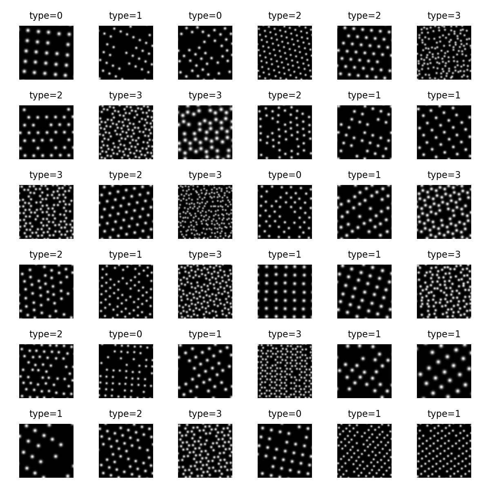
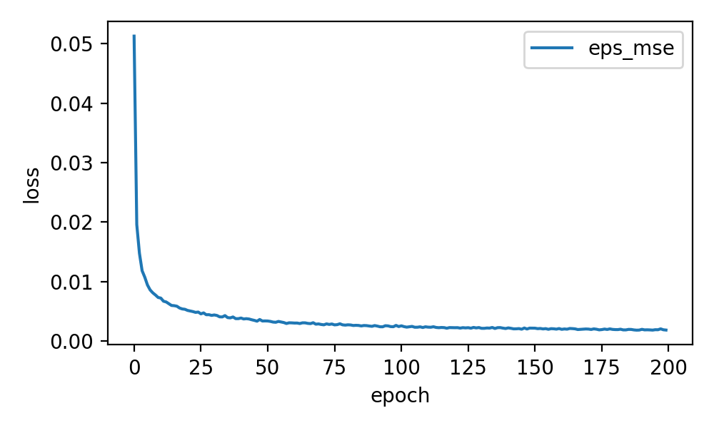

# ToyCrystals — conditional generation on synthetic lattice images

This repo explores conditional generation on a synthetic “toy-crystals” dataset: periodic lattice images rendered as Gaussian “atoms”.

There are **two main pipelines** in this project:

**A) VAE pipeline (with two priors)**
- A **conditional VAE** learns an encoder/decoder and reconstructs well.
- For sampling, we compare:
  - **standard Gaussian prior** \(z\sim\mathcal N(0,I)\) (baseline)
  - a **learned latent diffusion prior** \(p_\theta(z\mid c)\) trained on VAE latents (improves sampling)

**B) Direct diffusion pipeline**
- A **VP-SDE score model** trained directly on images (no VAE), sampled with probability-flow ODE or reverse-SDE.

Approach B follows standard diffusion / SDE notation as used in MIT’s diffusion course materials:
**MIT 6.S184: Generative AI with Stochastic Differential Equations**  
Course site: https://diffusion.csail.mit.edu/2025/

---

## Results (figures in `assets/`)

### Dataset preview
<p align="center">
  
</p>

---

## A) VAE pipeline

### A1) Conditional VAE

Let \(x \in [0,1]^{1\times H\times W}\) be an image and \(c\) the condition (lattice type + rotation). A conditional VAE uses:
- encoder \(q_\phi(z\mid x,c)\),
- decoder \(p_\theta(x\mid z,c)\),
- prior \(p(z)=\mathcal N(0,I)\).

Training objective (reconstruction MSE + \(\beta\)-weighted KL):
\[
\mathcal L_{\mathrm{VAE}}
= \mathbb E\big[\lVert x-\hat x\rVert_2^2\big]
+ \beta\, D_{\mathrm{KL}}\!\big(q_\phi(z\mid x,c)\,\Vert\,\mathcal N(0,I)\big).
\]

If “free-bits” are enabled:
\[
\mathrm{KL}_{\text{used}}=\sum_{j=1}^{d_z}\max(\mathrm{KL}_j,\tau).
\]

<table>
  <tr>
    <td align="center"><b>Reconstructions</b></td>
    <td align="center"><b>Loss curve</b></td>
  </tr>
  <tr>
    <td></td>
    <td></td>
  </tr>
</table>

### A2) Sampling with different priors

<table>
  <tr>
    <td align="center"><b>Standard prior</b> (\(z\sim\mathcal N(0,I)\))</td>
    <td align="center"><b>MoP / aggregated-posterior proxy</b></td>
  </tr>
  <tr>
    <td></td>
    <td></td>
  </tr>
</table>

- Standard-prior sampling is the baseline and can leave the data manifold.
- MoP sampling is an intentionally strong baseline (sampling near posteriors of real datapoints).

---

### A3) Latent diffusion prior (improves VAE sampling)

Instead of sampling \(z\sim\mathcal N(0,I)\), we train a diffusion model in latent space to approximate a better conditional prior \(p_\theta(z\mid c)\).

Forward diffusion:
\[
z_t = \sqrt{\bar\alpha_t}\, z_0 + \sqrt{1-\bar\alpha_t}\,\varepsilon,
\qquad \varepsilon\sim\mathcal N(0,I).
\]

Noise-prediction objective:
\[
\mathcal L_{\mathrm{diff}}
= \mathbb E \Big[\lVert \varepsilon - \varepsilon_\theta(z_t,t,c)\rVert_2^2\Big].
\]

Sampling is performed in latent space and then decoded via the VAE decoder.

<table>
  <tr>
    <td align="center"><b>Latent diffusion prior samples</b></td>
    <td align="center"><b>Training curve</b></td>
  </tr>
  <tr>
    <td></td>
    <td></td>
  </tr>
</table>

**Settings used for the diffusion-prior results**
- \(T = 1000\)
- width \(= 1024\)
- \(\beta_{\text{end}} = 0.05\)
- epochs \(= 300\)

---

## B) Direct diffusion pipeline: VP-SDE on images

VP-SDE forward process:
\[
\mathrm d x
= -\tfrac12 \beta(t)\,x\,\mathrm dt + \sqrt{\beta(t)}\,\mathrm dW,
\qquad
\beta(t)=\beta_{\min}+t(\beta_{\max}-\beta_{\min}).
\]

Using the marginal parameterisation:
\[
x_t = \alpha(t)\,x_0 + \sigma(t)\,\varepsilon,\qquad \varepsilon\sim\mathcal N(0,I),
\]
and the usual connection to an \(\varepsilon\)-predictor:
\[
s_\theta(x_t,t,c)\approx \nabla_x \log p_t(x\mid c)
= -\frac{\varepsilon_\theta(x_t,t,c)}{\sigma(t)}.
\]

Classifier-free guidance:
\[
\varepsilon_{\text{CFG}}
= \varepsilon_{\text{uncond}} + w\big(\varepsilon_{\text{cond}}-\varepsilon_{\text{uncond}}\big).
\]

<table>
  <tr>
    <td align="center"><b>Samples</b></td>
    <td align="center"><b>Training curve</b></td>
  </tr>
  <tr>
    <td></td>
    <td></td>
  </tr>
</table>

**Settings used for the final VP-SDE sample grid**
- steps \(= 300\)
- CFG \(= 1.50\)
- \(t_{\text{end}} = 0.005\)
- sampler = reverse-SDE (Euler–Maruyama)
- EMA enabled

---

## Running the code (copyable)
````bash
# 0) install
pip install torch
pip install -e .

# 1) build dataset
python scripts/build_dataset.py --out data/toycrystals_train_rotonly.pt --n-samples 50000 --img-size 64 --n-types 4 --rot-only

# 2) train VAE
python scripts/train_vae.py --data-path data/toycrystals_train_rotonly.pt --epochs 15 --batch-size 128 --z-dim 32

# 3) train latent diffusion prior (settings used for the figures)
python scripts/train_diffusion_prior.py --T 1000 --beta-start 1e-4 --beta-end 0.05 --width 1024 --t-emb-dim 64 --batch-size 256 --lr 1e-4 --epochs 300 --z-target mu --latent-cache data/latents_mu_T1000_b005.pt --prior-ckpt checkpoints/prior_mu_T1000_b005_w1024_lr1e-4.pt

# 4) train VP-SDE score model
python scripts/train_sde_score_model.py --data-path data/toycrystals_train_rotonly.pt --epochs 40 --batch-size 128 --lr 1e-4 --beta-min 0.1 --beta-max 30 --p-uncond 0.1 --ema-decay 0.999

# 5) sample VP-SDE (settings used for the final grid)
python scripts/sample_sde_score_model.py --device cuda --out-dir runs/sde_score/<run_dir_or_checkpoint_dir> --ckpt last --steps 300 --cfg 1.5 --t-end 0.005 --sampler sde --use-ema 1 --n 36
```

---

## Repo layout

- `src/toycrystals/…` — dataset + models
- `scripts/…` — training/sampling entry points
- `assets/…` — figures committed to git
- `data/`, `checkpoints/`, `results/`, `runs/` — generated artefacts (recommended to keep out of git)
