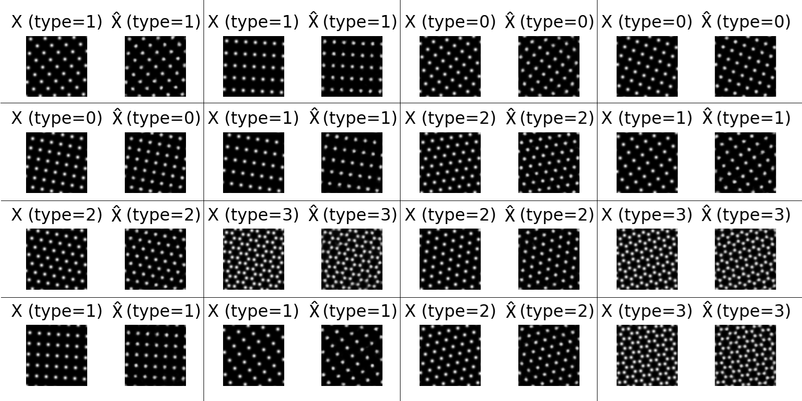
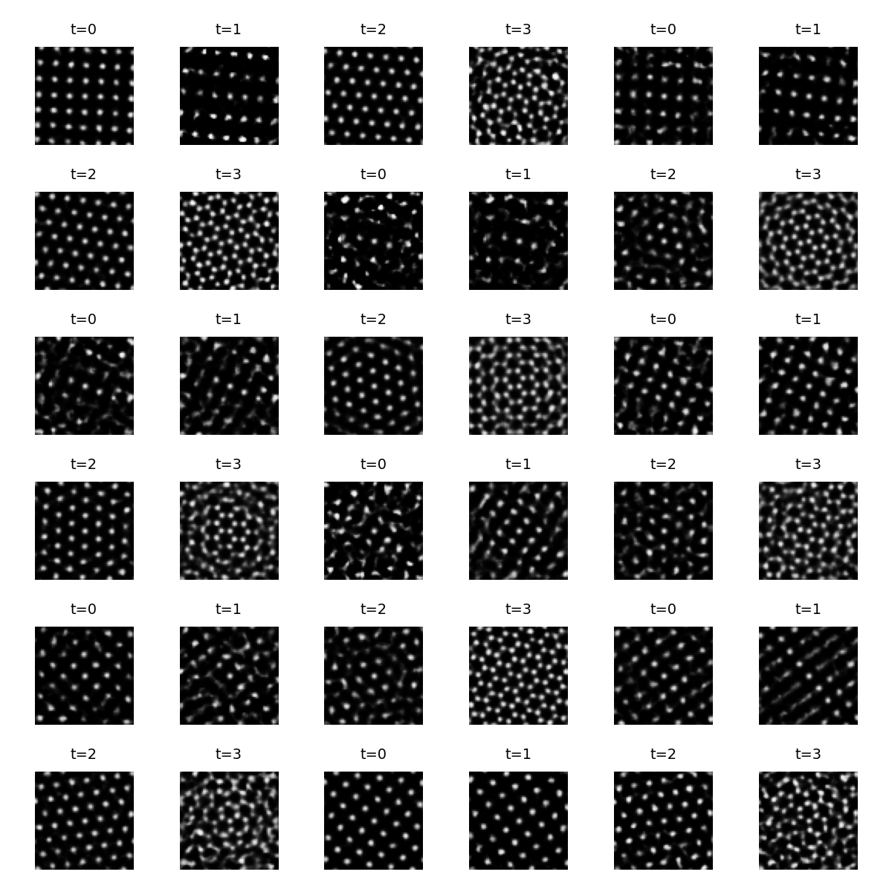
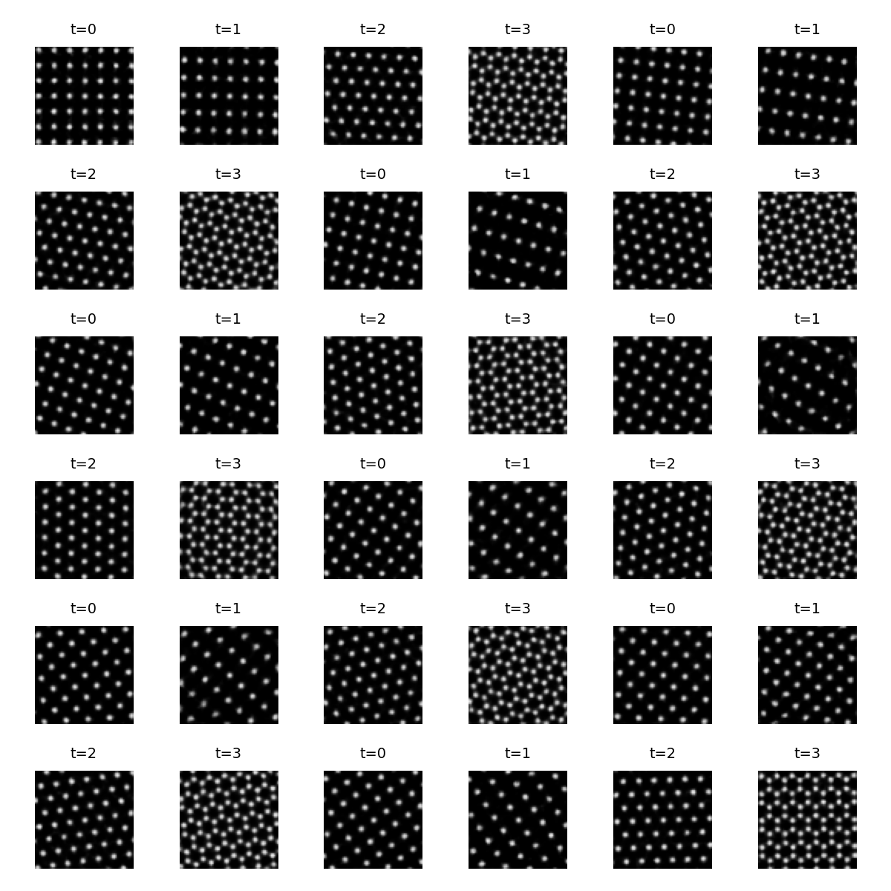
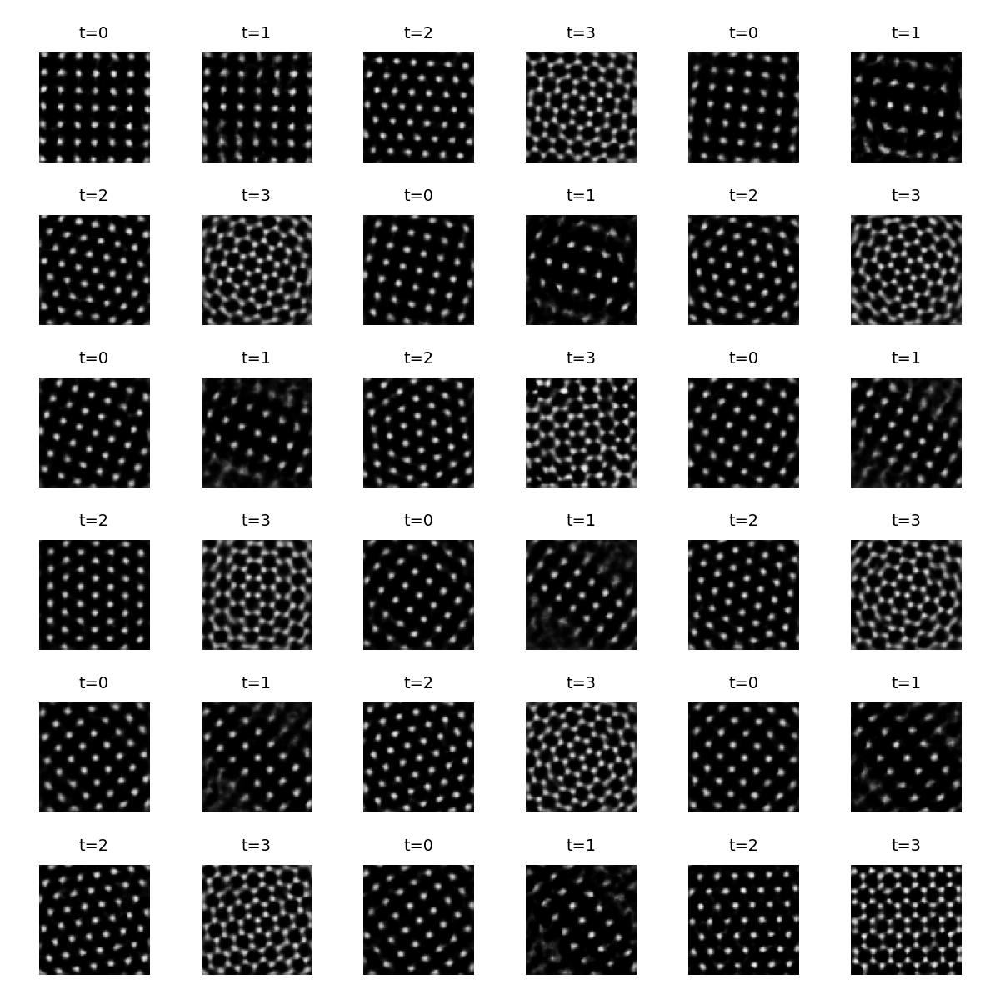
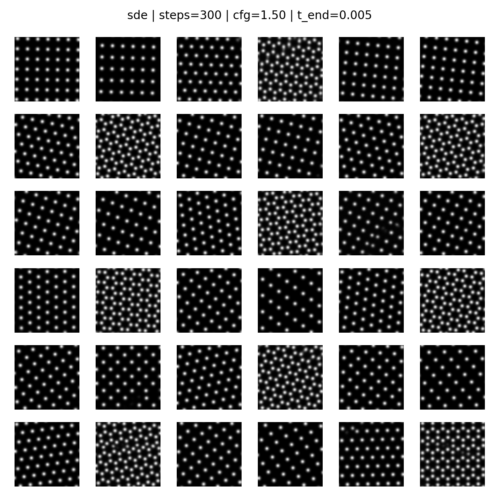

# ToyCrystals — conditional generation on synthetic lattice images

This repo explores conditional generation on a synthetic “toy-crystals” dataset: periodic lattice images rendered as Gaussian “atoms”.

There are two main pipelines:

A) **VAE pipeline (with two priors)**
- Train a conditional VAE (good reconstructions).
- For sampling, compare:
  - **standard Gaussian prior**: z ~ N(0, I)  (baseline)
  - **learned latent diffusion prior**: a diffusion model trained on VAE latents to approximate a better conditional prior p(z | c)

B) **Direct diffusion pipeline**
- A VP-SDE score model trained directly on images (no VAE), sampled with probability-flow ODE or reverse-SDE.

Approach B follows standard diffusion / SDE notation as used in MIT’s diffusion course materials: <br>
**MIT 6.S184: Generative AI with Stochastic Differential Equations** <br>
Course site: https://diffusion.csail.mit.edu/2025/

---

## Results (figures in `assets/`)

## A) VAE pipeline

### A1) Conditional VAE (reconstructions)
<p align="center">
  
</p>

### A2) Sampling with different priors

<table>
  <tr>
    <td align="center"><b>Standard prior sampling</b><br/>z ~ N(0, I)</td>
    <td align="center"><b>MoP / aggregated-posterior proxy</b></td>
  </tr>
  <tr>
    <td></td>
    <td></td>
  </tr>
</table>

**Qualitative comparison (why the prior matters)**  
- The VAE decoder learns a good mapping from “in-distribution” latents to images (reconstructions are crisp).
- But the VAE’s standard prior z ~ N(0, I) can be a mismatch to the encoder’s aggregated posterior, so samples can drift off the data manifold.
- MoP sampling is an intentionally strong reference point because it samples around posteriors of real datapoints (so it tends to stay on-manifold).

### A3) Latent diffusion prior (improving VAE sampling)
Instead of sampling z from N(0, I), a diffusion model is trained in latent space on cached VAE latents (often using z = μ). At sampling time, it generates z conditioned on c, and the VAE decoder maps z → image.

<p align="center">
  
</p>

**Qualitative comparison (standard prior vs diffusion prior)**  
- Standard-prior sampling is the simplest baseline, but it tends to produce more “off-manifold” artefacts.
- The latent diffusion prior usually gives **more consistent** samples because it is trained to match the latent distribution actually used by the decoder (conditioned on c), rather than assuming a single global Gaussian.
- MoP can still be hard to beat visually because it is anchored to real datapoints; the diffusion prior is the more realistic “learned prior” alternative.

**Diffusion-prior training settings used for the committed figure**
- T = 1000
- width = 1024
- beta_end = 0.05
- epochs = 300

---

## B) Direct diffusion pipeline (VP-SDE on images)

This approach trains directly on images (no VAE). It supports:
- probability-flow ODE sampling (deterministic)
- reverse-SDE sampling (stochastic; Euler–Maruyama)
- classifier-free guidance (CFG)
- optional EMA weights

<p align="center">
  
</p>

**VP-SDE sampling settings used for the final grid**
- steps = 300
- cfg = 1.50
- t_end = 0.005
- sampler = reverse-SDE (Euler–Maruyama)
- EMA enabled

---

## Repo layout

- src/toycrystals/…  — dataset + models
- scripts/…          — training/sampling entry points
- assets/…           — figures committed to git
- data/, checkpoints/, results/, runs/ — generated artefacts (recommended to keep out of git)

---

## Quickstart (commands)

### Install
```bash
pip install torch
pip install -e .

# 1) build dataset
python scripts/build_dataset.py --out data/toycrystals_train_rotonly.pt --n-samples 50000 --img-size 64 --n-types 4 --rot-only

# 2) train VAE
python scripts/train_vae.py --data-path data/toycrystals_train_rotonly.pt --epochs 15 --batch-size 128 --z-dim 32

# 3) train latent diffusion prior (settings used for the figures)
python scripts/train_diffusion_prior.py --T 1000 --beta-start 1e-4 --beta-end 0.05 --width 1024 --t-emb-dim 64 --batch-size 256 --lr 1e-4 --epochs 300 --z-target mu --latent-cache data/latents_mu_T1000_b005.pt --prior-ckpt checkpoints/prior_mu_T1000_b005_w1024_lr1e-4.pt

# 4) train VP-SDE score model
python scripts/train_sde_score_model.py --data-path data/toycrystals_train_rotonly.pt --epochs 40 --batch-size 128 --lr 1e-4 --beta-min 0.1 --beta-max 30 --p-uncond 0.1 --ema-decay 0.999

# 5) sample VP-SDE (settings used for the final grid)
python scripts/sample_sde_score_model.py --device cuda --out-dir runs/sde_score/<run_dir_or_checkpoint_dir> --ckpt last --steps 300 --cfg 1.5 --t-end 0.005 --sampler sde --use-ema 1 --n 36
```

---

## Repo layout

- `src/toycrystals/…` — dataset + models
- `scripts/…` — training/sampling entry points
- `assets/…` — figures committed to git
- `data/`, `checkpoints/`, `results/`, `runs/` — generated artefacts (recommended to keep out of git)
