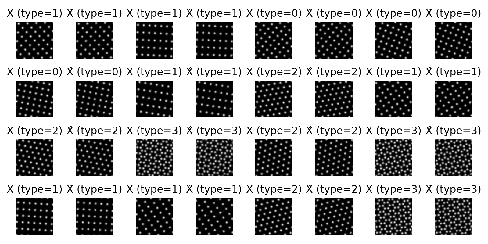
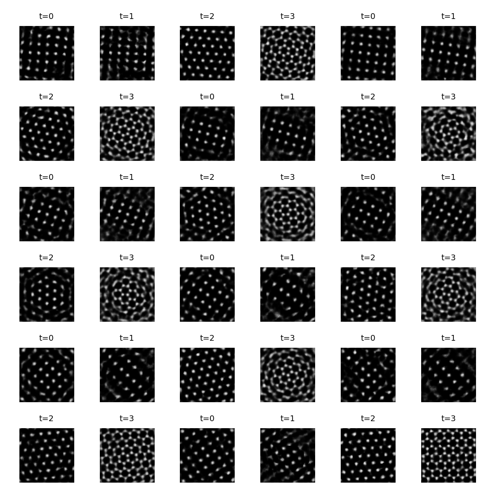

# Toy Crystals — conditional VAE and latent-prior experiments

Small, reproducible sandbox for conditional generative modelling on a synthetic “toy-crystals” dataset (periodic lattices rendered as Gaussian “atoms”).

It includes:
- a **conditional VAE** conditioned on **lattice type** (categorical) and **rotation** (continuous),
- baseline latent sampling via **$z \sim \mathcal{N}(0, I)$** and a **mixture-of-posteriors (MoP)** / aggregated-posterior proxy,
- a **latent diffusion prior** (DDPM-style noise-prediction objective, DDIM sampling) trained in latent space.

## Key results

Representative figures are committed under `assets/`:

- `assets/preview_toycrystals.png`  
  Dataset preview.

- `assets/cond_withrot/`  
  Main experiment: conditional VAE on `(type, theta)` with:
  - `vae_recon.png` — reconstructions (sanity check: encoder/decoder work)
  - `vae_samples_prior.png` — samples from standard VAE prior $z \sim \mathcal{N}(0, I)$
  - `vae_samples_mop.png` — samples from MoP / aggregated posterior proxy
  - `vae_loss.png` — training curve

- `assets/diffusion_firstattempt/`  
  Latent diffusion prior trained on cached encoder latents:
  - `diffusion_samples.png` — diffusion-prior samples (decoded through the VAE)
  - `diffusion_loss.png` — training curve

### Visual summary 
| Reconstructions (input $X$, reconstruction $\hat{X}$). |
|:--:|
|  |

| $z \sim \mathcal{N}(0, I)$ samples | MoP samples | Diffusion-prior samples |
|:--:|:--:|:--:|
|  |  |  |

### Qualitative takeaways
- **Reconstructions** are crisp and confirm the conditional VAE learns the data manifold.
- **$\mathcal{N}(0, I)$ prior sampling** often leaves the manifold (blurry / incorrect structure), indicating a prior mismatch.
- **MoP sampling** produces much cleaner outputs (sampling from encoder posteriors of real datapoints).
- **Diffusion prior** samples are typically **more consistent** than the standard prior samples, but do not yet reach the MoP baseline in this configuration.

## Dataset

Each datapoint is an image `x` of shape `[1, H, W]` plus conditioning:
- `y_cat`: lattice type (int)
- `y_cont`: continuous vector including `theta` (rotation angle).  
  In `rot_only` mode: `y_cont = [0, theta, 0, 0]`.

Two ways to obtain data:
1) On-the-fly generation for quick iteration.
2) Precomputed `.pt` files on disk for faster training and reproducibility.

## Scripts

- `scripts/preview_data.py` — quick dataset preview (writes to `results/`)
- `scripts/build_dataset.py` — generate and save a disk dataset (`.pt`)
- `scripts/train_vae.py` — train VAE and export reconstructions / prior samples / MoP samples
- `scripts/train_diffusion_prior.py` — build latent cache, train diffusion prior, sample and decode

## Installation

This project uses PyTorch, which is **not** pinned in `pyproject.toml` (so install it separately first).

```bash
python -m venv .venv
# activate venv
pip install -U pip

# install PyTorch (CPU/CUDA) using the official instructions for your system
pip install torch

# install this package
pip install -e .
```

## Quickstart
```bash
# 1) (optional) preview on-the-fly data
python scripts/preview_data.py

# 2) build a reproducible training dataset on disk
python scripts/build_dataset.py --out data/toycrystals_train_rotonly.pt --n-samples 50000 --img-size 64 --n-types 4

# 3) train the (conditional) VAE (use --uncond for an unconditional baseline)
python scripts/train_vae.py --data-path data/toycrystals_train_rotonly.pt --epochs 25

# 4) train the latent diffusion prior and sample (decoded through the VAE)
python scripts/train_diffusion_prior.py --epochs 200
```

## Score-based diffusion on images (VP-SDE)

In addition to the CVAE + latent diffusion prior, this repo includes a **score-based diffusion model trained directly on the lattice images**. The implementation follows the VP-SDE / score-matching view (as in the MIT 6.S184 course): we train a neural network to predict the Gaussian noise \(\epsilon\) along a known forward noising process, and generate samples by integrating the **probability-flow ODE**.

### What is implemented
- **VP-SDE (Ornstein–Uhlenbeck / variance-preserving)** forward process:
  \[
  x_t = \alpha(t)\,x_0 + \sigma(t)\,\epsilon,\quad \epsilon \sim \mathcal{N}(0,I)
  \]
- **Epsilon prediction** objective (denoising score matching):
  \[
  \min_\theta \; \mathbb{E}\|\epsilon_\theta(x_t,t,c) - \epsilon\|^2
  \]
- **Conditional generation** using the same conditions as the dataset:
  - categorical: lattice type
  - continuous: rotation (and other continuous fields if present)
- **Probability-flow ODE sampling** (Heun integrator), with optional classifier-free guidance (CFG).

### How to train
```bash
python scripts/train_sde_score_model.py \
  --data-path data/toycrystals_train_rotonly.pt \
  --out-dir runs/sde_score \
  --epochs 40 \
  --lr 1e-4 \
  --base-ch 64 \
  --beta-max 20 \
  --sample-every 10 \
  --sample-steps 200 \
  --cfg 1.5 \
  --t-end 1e-3


